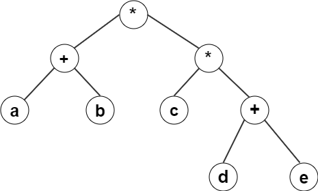

# ExpressionTree
The evaluation of arithmetic expressions using an expression tree.
The arithmetic expression can be formed with the binary operators: '+', '-', '*', '*'. 
'-' ("minus") can be used as a unary operator.
For specifying priorities of subexpressions the brackets '(', ')' can be used.

## Example of the expression tree data structure:
 
